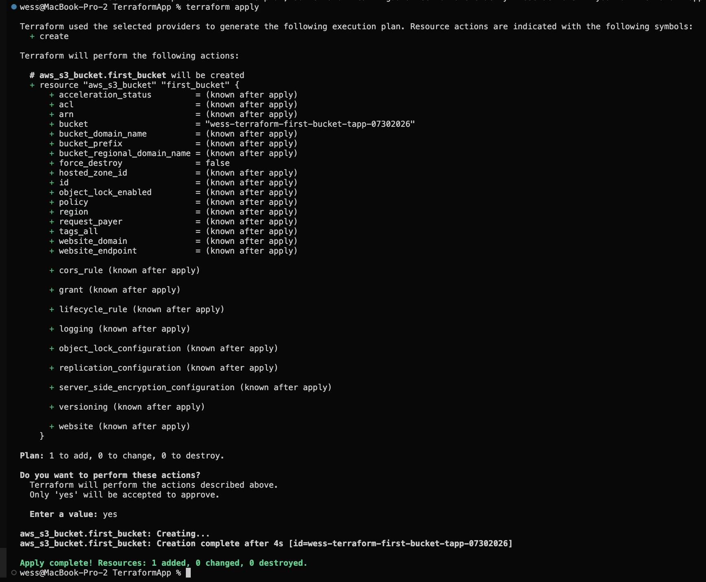
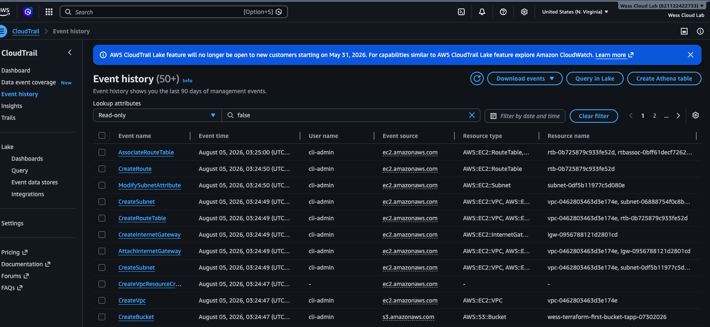
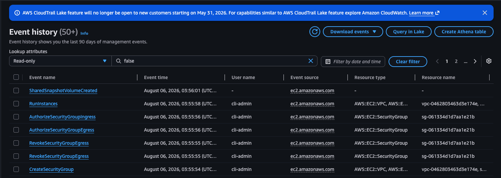
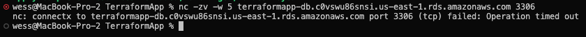
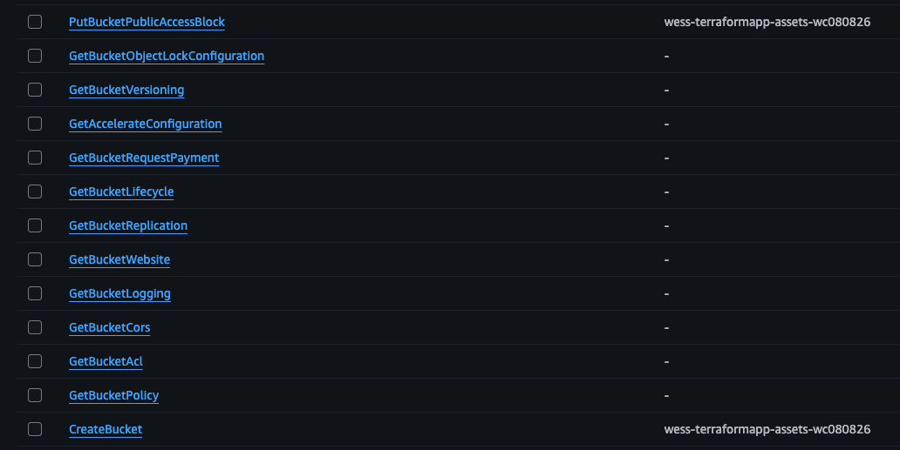
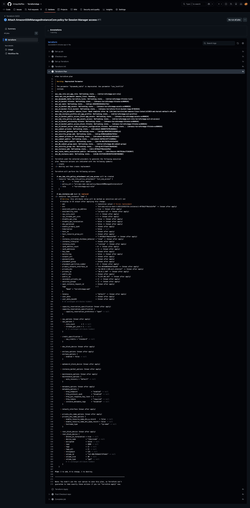
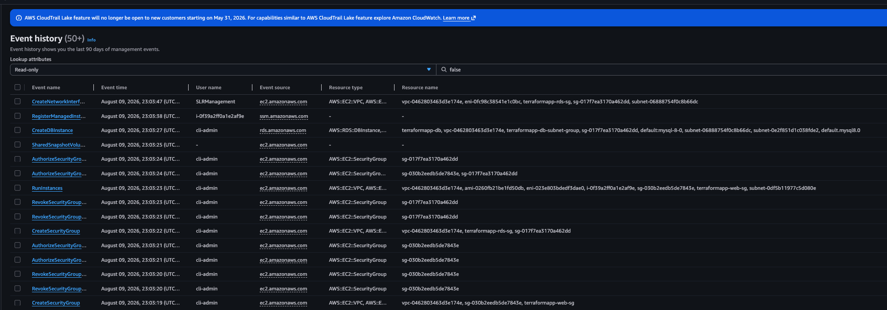
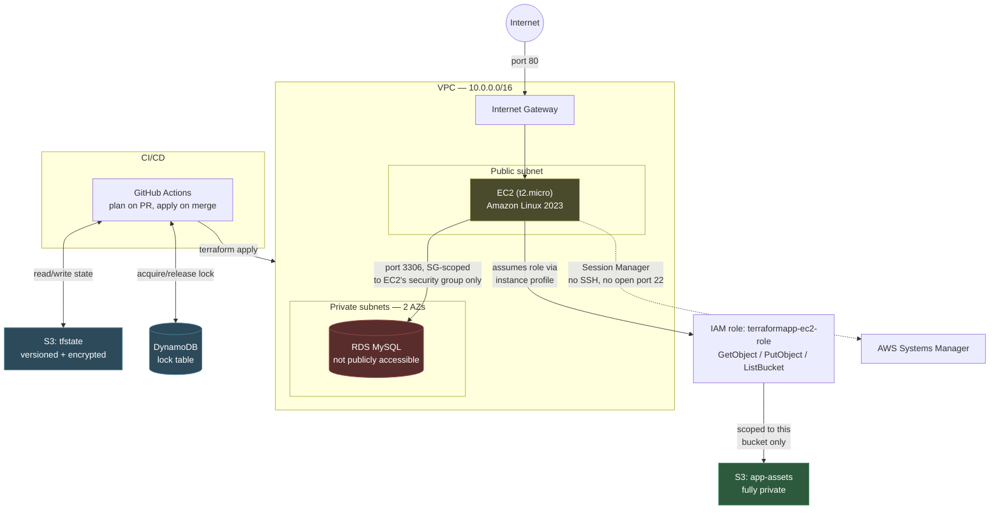

# TerraformApp

This project is my hands-on introduction to Terraform and AWS. Rather than just
reading docs or watching tutorials, I'm using it to actually provision
infrastructure — starting small (a single S3 bucket) and building up to a full
3-tier AWS application (VPC, EC2, RDS, S3, CI/CD). The goal is to understand how
real apps get built and hosted on cloud infrastructure by doing it myself, not
just following along.

## Status

**Done:** Terraform installed and AWS CLI configured. Ran a full practice loop —
declared an S3 bucket in `main.tf`, created it with `terraform apply`, verified
it existed, then tore it down with `terraform destroy`. Confirmed the full
create/destroy cycle in AWS CloudTrail.



Built the VPC (public/private subnets, internet gateway, route table) — left
running, since none of these pieces cost anything hourly. Built an EC2 instance
and security group in the public subnet, verified it in CloudTrail, then
destroyed just those two resources with a targeted `terraform destroy`, leaving
the VPC intact.




Added a second private subnet (RDS requires a DB subnet group spanning at least
two Availability Zones) and built RDS alongside a rebuilt EC2 instance, so the
security boundary between them would mean something. RDS's security group only
allows its port from the EC2 security group, not from any IP range. Verified
that boundary two ways: in CloudTrail (the `AuthorizeSecurityGroupIngress` event
shows the RDS security group authorized specifically against the EC2 security
group's ID) and empirically (`nc` from my own laptop to the RDS endpoint timed
out, since my IP isn't in the allow list). Destroyed both EC2 and RDS afterward
with a targeted `terraform destroy`, again leaving the VPC intact.



Built the app-tier S3 bucket, fully private (all four public-access-block
settings on), plus an IAM role, policy, and instance profile scoped to exactly
that bucket — `GetObject`/`PutObject`/`ListBucket` only, nothing broader. This
is unlike EC2/RDS: S3 isn't inside the VPC at all, so access is controlled by
IAM identity rather than network location (no security group applies here).
Left the bucket and IAM resources running (no hourly cost); EC2 and RDS remain
torn down until a deliberate end-to-end pass attaches the instance profile to
a running EC2 instance and proves it can actually use the role.



Built a remote state backend: a dedicated, versioned, encrypted S3 bucket for
`terraform.tfstate` plus a DynamoDB table for state locking. Migrated existing
local state into it with `terraform init`. This exists because GitHub Actions
runners are disposable — a fresh, empty machine spins up for every run, with
no access to a local state file. Without a shared remote backend, CI would have
no memory of what already exists in AWS and would try to recreate everything.

Built the GitHub Actions workflow (`.github/workflows/terraform.yml`): `plan`
on every PR, `apply` on merge to `main`. Opened a real PR to test it before
trusting it with anything — the plan-only run surfaced a chain of real CI/CD
issues one at a time (see Lessons learned), each fixed and re-verified until
the check came back clean: `Plan: 4 to add, 0 to change, 0 to destroy`, with
the Apply step correctly skipped (0s, not run) since a PR isn't a merge.



Merged the PR — the first real CI-driven `apply` ran successfully, confirmed
in CloudTrail: security groups, EC2, and RDS all created by `cli-admin` via
the pipeline, no manual terminal involved.



While verifying, noticed the EC2 instance was running an unexpected
ECS/Neuron-optimized AMI instead of plain Amazon Linux 2023 — the `aws_ami`
data source's wildcard filter (`al2023-ami-*-x86_64`) matched more than
intended, and `most_recent = true` silently picked whichever AWS published
last. Fixed by switching to the unambiguous SSM parameter
`/aws/service/ami-amazon-linux-latest/al2023-ami-kernel-default-x86_64`.
Also attached the `AmazonSSMManagedInstanceCore` managed policy to the EC2
role, enabling Session Manager access with no SSH keys, no open port 22.

Ran the full end-to-end proof: used `aws ssm send-command` to run a script
*on* the EC2 instance — no local credentials involved — that wrote a file and
uploaded it to the app-tier S3 bucket. Output confirmed the instance was
operating as `assumed-role/terraformapp-ec2-role`, and the upload succeeded
using only the scoped IAM policy from the S3 stage. Verified independently
from my own laptop afterward that the file was really there.

Ran the final teardown. Since state lived in the S3/DynamoDB backend built
earlier, destroying it while Terraform was actively using it to track the
destroy itself would have been self-referential — so first removed the
`backend "s3"` block and ran `terraform init -migrate-state` to bring state
back to a local file, *then* ran `terraform destroy` against that local copy,
which could safely remove the backend resources too since nothing depended on
them being live anymore. 22 of 24 resources destroyed cleanly on the first
pass; the two S3 buckets (state backend and app-assets) failed with
`BucketNotEmpty` — both still had real content (state file versions, the SSM
test upload) and neither had `force_destroy` set. Added it, applied that one
attribute change, destroyed again — clean. Verified zero resources remain
across EC2, RDS, VPC, DynamoDB, S3, and IAM.


**Project complete.** App logic for the EC2 tier was intentionally left TBD —
the goal was the infrastructure and pipeline, not a specific app. Remaining:
final architecture diagram.

## Prerequisites

- macOS with [Homebrew](https://brew.sh) installed
- [Git](https://git-scm.com/) installed, to clone this repo
- Terraform, installed via:
  ```bash
  brew tap hashicorp/tap && brew install hashicorp/tap/terraform
  ```
- AWS CLI installed and configured (`aws configure`) with an IAM user's access
  keys — not root, and not just a console login
- An AWS account with permissions to create the resources in this repo
- Confirm both are working:
  ```bash
  terraform version
  aws sts get-caller-identity
  ```

## How to run it

1. Configure AWS credentials (one-time):
   ```bash
   aws configure
   ```
2. Create a `.gitignore` (already done in this repo) to protect state files
3. Write `main.tf` declaring the resource(s) to create
4. Run the loop:
   ```bash
   terraform init      # downloads the AWS provider plugin
   terraform plan      # preview what will be created — read this output
   terraform apply     # type "yes" to actually create it
   ```
5. Verify the resource exists (`aws s3 ls`, or check CloudTrail)
6. Tear it down when done:
   ```bash
   terraform destroy   # type "yes" — don't skip this
   ```

## Architecture

Built, proven end-to-end, and torn down — see Status above for how each piece
was verified. Redeployable any time via `terraform apply` (see below).



- **VPC** — the network boundary everything else lives inside, split into a
  public subnet and private subnets across 2 Availability Zones
- **EC2** (public subnet) — runs the application, reachable from the internet
  on port 80; administered via Session Manager, not SSH
- **RDS** (private subnets) — the application's database, reachable only from
  EC2's security group, never directly from the internet — proven by a timed-out
  connection attempt from an unauthorized IP (see Lessons learned)
- **S3 (app assets)** — fully private; access granted only via an IAM
  role/instance profile scoped to exactly this bucket, not a security group —
  S3 lives outside the VPC entirely, so identity controls access, not network
  location
- **CI/CD** — GitHub Actions runs `terraform plan` on every PR, `terraform
  apply` on merge to main, authenticated via repository secrets
- **Remote state backend** — a separate, dedicated S3 bucket (versioned,
  encrypted) plus a DynamoDB lock table, so both my laptop and GitHub Actions
  read/write the same `terraform.tfstate`, never a local file

## Lessons learned

- `terraform destroy` with no arguments destroys **everything** in the state
  file, not just what you're currently working on. Learned this the hard way
  when destroying the EC2 instance almost took the VPC down with it. Use
  `-target` to scope a destroy to specific resources — but treat that as an
  exception for iterating on one layer at a time, not the default workflow.
  A real team's state file usually represents a shared environment, so an
  untargeted destroy there has a much bigger blast radius than "redo a lab."
- For anything holding real data (RDS, in particular), always confirm a final
  snapshot is enabled before destroying — an EC2 instance is annoying to
  recreate, but a database without a snapshot means the data itself is gone.
- One syntax mistake early in `main.tf` (an unterminated string) cascaded into
  dozens of unrelated-looking `terraform validate` errors for every line after
  it. When facing a wall of errors, fix the *first* one reported and re-check
  before assuming the rest are real — most of them were fallout, not separate
  bugs.
- Getting CI/CD actually working took several rounds of debugging, each a
  distinct lesson:
  - A GitHub secret's **value** must be the bare credential only — no
    `key = ` prefix copied in from a config file's syntax, no quotes.
  - Secrets have to live under **Repository secrets** specifically —
    "Environment secrets" is a different, more restricted scope the workflow
    can't see unless it explicitly opts in.
  - Each credential needs its **own separate named secret** — two values
    stacked into one secret under a project-themed name isn't the same as two
    secrets with the exact names the workflow references.
  - `terraform.tfvars` is gitignored on purpose, which means CI never has it.
    Any variable it holds (`db_username`, `db_password`) has to be passed to
    CI a different way — as a `TF_VAR_<name>` environment variable, sourced
    from its own GitHub secret. I initially added the secrets but forgot to
    actually wire them into the workflow's `env:` block — the values existed,
    the workflow just never looked for them.
  - Cancelling a run that's stuck mid-`plan`/`apply` leaves the DynamoDB state
    lock orphaned, since Terraform never gets to run its normal cleanup. Fix:
    `terraform force-unlock <LOCK_ID>` from a machine with backend access.
  - Re-running an *old* Actions run replays against the commit it originally
    ran on, not the latest one — pushing a fix doesn't help a run you re-run
    from before that fix existed. Check which commit a run is actually tied
    to before trusting its result.
  - By default the workflow ran on *every* push to `main` — including a
    commit that only added a screenshot, with no infrastructure change at
    all. Scoped the triggers with `paths:` so `plan`/`apply` only run when
    `.tf` files or the workflow file itself change; everything else (docs,
    images) can be committed without spinning up a pipeline run.
- A `data "aws_ami"` filter using a wildcard (`al2023-ami-*-x86_64`) combined
  with `most_recent = true` isn't as specific as it looks — it silently
  matched an ECS/Neuron-optimized image instead of plain Amazon Linux, and
  which AMI it resolves to can drift over time as AWS publishes new images.
  The fix: use AWS's official SSM parameter for "the current AMI" instead of
  a name filter — deterministic, no ambiguity.
- Session Manager (via the `AmazonSSMManagedInstanceCore` policy) turned out
  to be a better fit than SSH for testing the EC2 instance — no key pair to
  generate or protect, no port 22 open in the security group, and access is
  controlled entirely through the same IAM role already built for S3 access.
- Tearing down a backend you're actively using to store state is a real
  chicken-and-egg problem — solved by migrating state back to local first,
  destroying everything (backend included) against that local copy, so
  nothing is destroying the shelf it's standing on.
- `force_destroy = true` on an S3 bucket only takes effect once it's actually
  **applied** — adding it to `main.tf` and immediately running `destroy`
  isn't enough, because destroy reads the resource's last-applied *state*,
  not fresh config. Had to `apply` the attribute change first (a targeted
  apply, to avoid recreating the 22 resources still declared in `main.tf`
  but already destroyed), then `destroy` worked.
